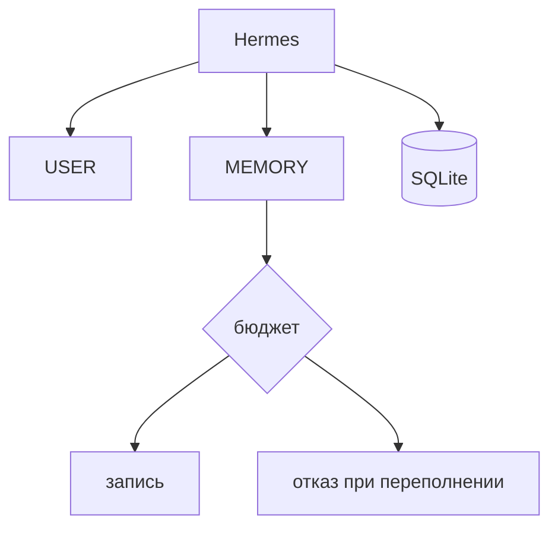

## Коротко о Hermes

<!--

-->

---
transition: slide-left
layout: simple-slide
---

## Что такое Hermes

<v-clicks>

- Агент как опенкло ток с памятью
- Чуть другой интерфейс
- Удобная работа с профилями
- Управление голосом из коробки
- Миграция с опенкло из коробки

</v-clicks>

<!--

[click]

[click]

[click]

[click]

[click]

-->

---
transition: slide-left
layout: simple-slide
---

## Память

<v-clicks>

- USER и MEMORY
- Сессии в SQLite
- Бюджет памяти с отказом при переполнении

</v-clicks>

<!--

[click]

[click]

[click]

-->

---
transition: slide-left
layout: simple-slide
---

## Критика

<v-clicks>

- Память на 1300 токенов
- Может переписать свой скилл, если не бить по рукам
- Попрожорливее (по инфе на май)

</v-clicks>

<!--

[click]

[click]

[click]

-->
