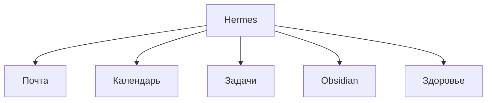
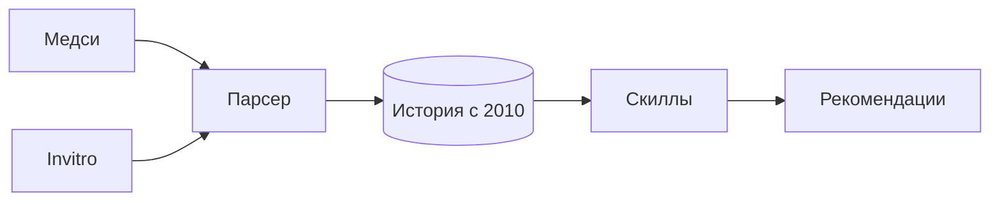

## Мой Hermes

<!--

-->

---
transition: slide-left
layout: simple-slide
---

## Такие агенты полезны только при наличии нужных интеграций

<!--

-->

---
transition: slide-left
layout: simple-slide
---

## Почта

<v-clicks>

- камон, нахуй надо)

</v-clicks>

<!--

[click]

-->

---
transition: slide-left
layout: simple-slide
---

## Календарь

<v-clicks>

- Google через Singularity
- Yandex через Singularity
- Singularity XD

</v-clicks>

<!--

[click]

[click]

[click]

-->

---
transition: slide-left
layout: simple-slide
---

## Задачи

<v-clicks>

- Singularity
- Пробовал Vikunja

</v-clicks>

<!--

[click]

[click]

-->

---
transition: slide-left
layout: simple-slide
---

## Obsidian

<v-clicks>

- Только поиск и чтение
- Не делал RAG, но можно
- Здоровье, учёба, планы, задачи, канбан

</v-clicks>

<!--

[click]

[click]

[click]

-->

---
transition: slide-left
layout: simple-slide
---

## Здоровье

<v-clicks>

- Парсер по форматкам Медси + Invitro
- История с 2010
- Анализ скиллами состояния и рекомендации

</v-clicks>

<!--

[click]

[click]

[click]

-->

---
transition: slide-left
layout: simple-slide
---

## Вы можете пойти иначе:

<v-clicks>

- сделать RAG по заметкам, книгам, выпискам здоровья
- сделать WatchDog на обновление
- MCP с тулами на поиск, добавление, etc

</v-clicks>

получится второй мозг.

<!--

[click]

[click]

[click]

[click]

-->
