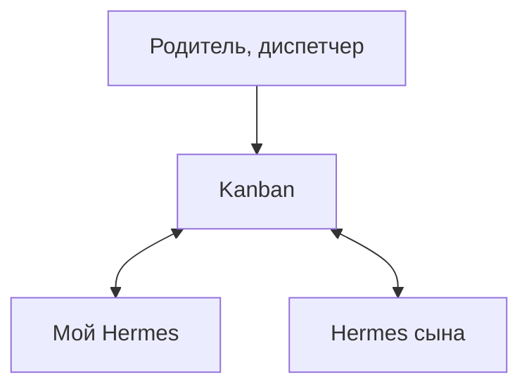

## Общие задачи

<!--

-->

---
transition: slide-left
layout: simple-slide
---

## A2A Kanban

<v-clicks>

- Одна общая доска
- Родитель, диспетчер
- Декомпозиция

</v-clicks>

<!--

[click]

[click]

[click]

-->

---
transition: slide-left
layout: simple-slide
---

## Singularity

<v-clicks>

- Разделение досок
- Удобный дедлайн
- Повторяющиеся задачи

</v-clicks>

<!--

[click]

[click]

[click]

-->
